# 函数调用原理：从 C++ 表达式到机器指令

> 本章的目标不是背某一份汇编，而是建立一个可迁移的观察方法：先看 C++ 语义，再看 ABI 如何传参，最后看编译器是否因为优化改变了实现形态。

## 0. 重要性和适用范围

- **P0（必须掌握）**：调用点、形参/实参、返回值、`this` 指针、寄存器与栈、调用约定、未定义行为。
- **P1（企业开发常用）**：调试栈帧、看反汇编、识别内联/尾调用/间接调用、理解异常展开和线程栈限制。
- **P2（按需深入）**：具体 ABI 的栈对齐、结构体返回规则、可变参数、协程和信号处理。

## 1. 先区分三层事实

### 1.1 C++ 标准保证什么

标准规定了表达式含义、类型检查、对象生命周期、求值顺序中被规定的部分、异常和可观察行为等。它**不保证**：

- 一定有栈帧、帧指针或“从右到左压栈”；
- 参数一定放在内存中；
- 一定通过 `call`/`bl` 指令调用；
- 返回地址一定在栈上；
- 某个类一定有一个名为 `vptr` 的字段。

### 1.2 ABI 规定什么

ABI（应用程序二进制接口）规定二进制之间如何协作，例如寄存器用途、栈对齐、参数和返回值位置、名称修饰、异常和 RTTI 的约定。不同平台的 ABI 不同：

- ARMv7 AAPCS 常用 `r0-r3` 传递前几个整数/指针参数，整数返回值通常在 `r0`；
- AArch64 常用 `x0-x7`；
- x86-64 Windows 与 System V Linux 的寄存器约定又不同。

### 1.3 编译器和优化器决定什么

在不改变可观察行为的前提下，编译器可以：

- 把参数一直留在寄存器；
- 消除栈帧和帧指针；
- 内联函数、传播常量、删除无效代码；
- 把尾部调用改成跳转；
- 将函数调用改造成直接计算。

所以不要把一段 `-O0` 的 ARM 汇编写成“C++ 函数调用的唯一实现”。

## 2. 一个调用表达式发生了什么

```cpp
int sum(int a, int b) {
    return a + b;
}

int main() {
    int x = sum(10, 20);
    return x;
}
```

从语言层面，可以按下面的顺序理解：

1. 编译器在调用点完成名字查找和重载决议，确认调用的是 `sum(int, int)`；
2. 计算实参表达式 `10` 和 `20`；
3. 按 ABI 把实参交给被调用函数；
4. 被调用函数建立自己的执行状态，使用形参计算结果；
5. 把 `int` 返回值交给调用者；
6. 调用者用返回值初始化 `x`。

“形参接收实参”是语义上的描述。实现上，编译器可能让形参直接对应寄存器，也可能在调试构建中把寄存器内容保存到栈槽，以便调试器显示变量。

## 3. 栈、寄存器和栈帧

### 3.1 常见角色

以下名称只是常见架构的叫法，不能当成 C++ 规则：

| 角色 | 作用 |
|---|---|
| SP | 栈指针，指向当前栈空间边界；函数进入/退出时经常调整 |
| FP | 帧指针，指向一个稳定的栈帧基准；优化构建中可能省略 |
| LR | 链接寄存器；ARM 的 `bl` 通常把返回地址写入 LR |
| 参数寄存器 | 传递整数、指针或浮点参数；具体寄存器由 ABI 决定 |
| 返回值寄存器 | 返回标量或部分小对象；复杂对象可能使用隐藏返回地址 |

栈通常向低地址增长，但这也是平台约定，不是 C++ 语义。栈帧中的具体偏移还会受局部变量、寄存器保存、对齐、栈保护和调试选项影响。

### 3.2 ARMv7、未优化构建中的典型序列

下面只是帮助阅读旧笔记中 ARM 汇编的模型。实际编译结果可能完全不同。

```asm
push {fp, lr}       ; 保存旧 fp 和返回地址
add  fp, sp, #4     ; 建立一个便于调试的帧基准
sub  sp, sp, #N     ; 为局部变量和对齐空间留出空间
...
sub  sp, fp, #4     ; 回到保存旧 fp 的栈位置
pop  {fp, pc}       ; 恢复 fp，并跳回返回地址
```

在另一些 ARM 代码中，`lr` 可能只暂存在寄存器里；如果函数不再调用别人，还可能直接 `bx lr` 返回。不要看到一条 `push` 就推断“所有参数都压栈了”。

### 3.3 调用点的典型形态



> 图中按 ARMv7 AAPCS32、`-O0`、保留 `fp` 的典型实现绘制；栈槽偏移用于教学示意，不是所有编译器都固定采用的布局。


```asm
; 伪代码，仅表示数据流
mov  r0, #10        ; 第一个参数
mov  r1, #20        ; 第二个参数
bl   sum            ; 跳转，并把返回地址放入 lr
str  r0, [local_x]  ; 使用返回值
```

如果 `sum` 被内联，可能只剩一条常量计算；如果 `sum` 被尾调用，调用者可能不再创建自己的返回路径；如果调用的是函数指针或虚函数，可能出现 `blx` 或通过寄存器间接跳转。

## 4. 实参求值顺序不是“从左到右压栈”

“从右到左压栈”是某些旧式调用约定的实现细节，不能概括 C++。更重要的是，函数参数的求值顺序不能随意假定为从左到右：

```cpp
int next();
void f(int, int);

f(next(), next()); // 不要依赖哪个 next() 先发生
```

工程代码应避免让同一表达式中的多个实参互相修改同一状态。C++17 以后，函数参数的求值不会交错，但仍不等于固定的左到右顺序；不同编译器或不同优化级别仍可能选择不同先后顺序。

## 5. 参数传递的几种语义

### 5.1 按值传递

```cpp
void set_value(int x) { x = 42; }
```

调用者的 `int` 值被复制到被调用函数可用的参数对象中。小标量常直接走寄存器；大对象按值传递时，ABI 可能使用调用者提供的临时存储区或隐藏指针。不要只凭“看到一个指针”就认为源代码写的是引用。

### 5.2 指针和引用参数

```cpp
void set_by_pointer(int* p) { *p = 42; }
void set_by_reference(int& x) { x = 42; }
```

两者在常见 ABI 中都可能以地址传递，但语义不同：指针可以为空、可以改指向；引用必须绑定到对象，表达的是别名关系。引用不要求实现上一定占一个指针大小，优化器也可能完全消除它。

### 5.3 成员函数的隐式 `this`

```cpp
struct Counter {
    void add(int n) { value += n; }
    int value{};
};

Counter c;
c.add(3);
```

成员函数可以粗略理解为多了一个隐式对象参数：

```cpp
// 仅作概念模型，不是可直接替代的声明
void Counter_add(Counter* this_, int n);
```

`const` 成员函数的对象参数只能通过只读视角访问对象；静态成员函数没有 `this`。虚函数还可能需要通过对象中的虚表信息完成间接分派。

## 6. 返回值

### 6.1 标量

像 `int`、指针这类小标量通常通过约定的返回值寄存器返回：

```asm
add r0, r0, r1   ; 以 ARMv7 为例，结果放回 r0
bx  lr
```

这不是“C++ 规定返回值在 r0”，而是该 ABI 的约定。

### 6.2 对象返回值和隐藏返回地址

复杂对象常常需要调用者提供一块目标存储区，被调用函数在这块存储区中构造结果。这里容易产生一个误解：所谓“从栈返回”，通常不是被调用函数把结果 `push` 到自己的栈帧，再由调用者取出；而是调用者先准备好结果对象的存储空间，把这块空间的地址作为一个隐藏参数传给被调用函数。

这个隐藏参数常被称为 `sret`（structure return）指针。以 ARMv7 AAPCS32 基础标准为例：

- `int`、指针等 4 字节标量通常通过 `r0` 返回；
- `long long`、`double` 等 8 字节标量通常通过 `r0` 和 `r1` 返回；
- 大于 4 字节的复合类型通常由调用者提供返回空间，被调用函数直接写入该空间；
- 如果使用内存返回，返回空间地址放在 `r0`，因此显式参数从 `r1` 开始分配，而不是从 `r0` 开始。

具体规则以目标平台的 ABI 为准；C++ 非平凡类对象的细节还可能受到 C++ ABI 和编译器实现的影响。可参考 [ARM AAPCS32：Result Return 和 Parameter Passing](https://github.com/ARM-software/abi-aa/blob/main/aapcs32/aapcs32.rst)。

例如：

```cpp
struct Big {
    int data[8];       // 32 字节
};

Big make_big(int x);

int main() {
    Big b = make_big(7);
}
```

调用者的概念汇编如下：

```asm
sub  sp, sp, #32      ; 在调用者的栈帧中预留 Big b
mov  r0, sp           ; 隐藏参数：r0 = &b
mov  r1, #7           ; 显式参数 x 从 r1 开始
bl   make_big

; make_big 返回后，b 已经位于调用者预留的空间中
add  sp, sp, #32      ; 调用者最后回收 b 的栈空间
```

被调用函数可以粗略理解为：

```asm
make_big:
    push {fp, lr}
    add  fp, sp, #4
    sub  sp, sp, #16

    str  r0, [fp, #-8]       ; 保存隐藏返回地址，也就是 &b
    str  r1, [fp, #-12]      ; 保存显式参数 x

    ldr  r2, [fp, #-8]       ; r2 = &b
    ldr  r3, [fp, #-12]      ; r3 = x
    str  r3, [r2, #0]        ; b.data[0] = x
    str  r3, [r2, #4]        ; b.data[1] = x
    ; ...继续向 r2 指向的空间写入 Big 对象

    sub  sp, fp, #4
    pop  {fp, pc}
```

此时的栈关系可以这样理解：

```text
高地址
┌──────────────────────────────┐
│ 调用者的其他局部变量          │
├──────────────────────────────┤
│ Big b，占 32 字节              │◄── r0 = &b
├──────────────────────────────┤
│ 调用时的 SP                   │
├──────────────────────────────┤
│ 被调用者的局部变量             │
├──────────────────────────────┤
│ 保存的旧 fp                   │
│ 保存的返回地址 lr             │
└──────────────────────────────┘
低地址
```

调用者和被调用者使用的是同一个进程栈，但返回对象 `b` 属于调用者的栈帧。被调用者只是通过 `r0` 指向的地址写入对象，退出时只回收自己的栈帧，不会回收调用者的 `b`。

因此，下面这种汇编：

```asm
bl   add
str  r0, [fp, #-4]
```

也不能直接说明“返回值通过栈返回”。对于 `int add()`，ABI 返回动作已经在 `r0` 中完成；后面的 `str` 只是调用者把 `r0` 保存到自己的局部变量中。真正的内存返回是“调用前就准备好目标地址，函数直接把结果写入该地址”。

对于 C++ 对象：

```cpp
// 概念模型，真实签名由 ABI 和编译器决定
void make_into(String* result);
```

`String` 的构造函数可能直接在 `result` 指向的空间中构造对象。因此：

```cpp
String s = make_string();
```

不一定意味着先在被调用者栈帧中创建一个临时 `String`，再复制到 `s`。编译器可能直接使用调用者为 `s` 准备的空间；返回局部变量时还可能使用 NRVO。C++17 的保证拷贝消除则可能让某些同类型临时对象直接构造在最终目标位置。详见 [07-匿名变量和函数返回.md](./07-匿名变量和函数返回.md)。

## 7. 为什么 `-O0` 和 `-O2` 差别很大

```cpp
int add(int a, int b) { return a + b; }
```

在 `-O0` 下，编译器倾向于保留变量和调用边界，便于调试；在 `-O2` 下，可能发生：

- `add` 被内联；
- 形参不落栈；
- `return a + b` 直接融合到调用者；
- 无用的局部变量被删除；
- 尾部调用复用当前栈帧。

这不是编译器“漏生成了代码”，而是 C++ 只要求程序具有规定的可观察行为。调试器显示的变量也可能因为优化而不可用或显示为 `<optimized out>`。

## 8. 企业级排查方法

遇到“代码到底调用了哪个函数”时，按以下顺序排查：

1. 先看源码：名字查找、重载、模板实参、虚函数、默认参数；
2. 再确认编译选项：语言标准、优化级别、LTO、调试信息、异常和 RTTI；
3. 查看目标文件的符号：`nm -C`、`readelf -Ws`、`objdump -drC`（Linux/ELF 工具）；
4. 对照目标平台 ABI 文档，而不是套用另一架构的寄存器图；
5. 最后才解释具体指令，并明确这是某个编译器/版本/架构/优化级别的结果。

可使用下面的最小实验：

```bash
# 生成汇编，保留源代码行号
g++ -std=c++20 -O0 -g -S call.cpp -o call-O0.s
g++ -std=c++20 -O2 -S call.cpp -o call-O2.s

# 生成目标文件并查看解码后的符号
g++ -std=c++20 -O2 -c call.cpp -o call.o
nm -C call.o
objdump -drC call.o
```

Windows/MSVC 应使用对应的 `/FAs`、`dumpbin /symbols`、调试器反汇编等工具；工具不同，问题拆解方法不变。

## 9. 本章结论

- C++ 源码表达的是语义；寄存器、栈帧和指令是 ABI 与编译器的实现。
- `bl`、`push`、`fp-16` 等只在给定架构和构建条件下有意义。
- 参数求值顺序、返回对象位置、是否有栈帧，都不能靠习惯推断。
- 观察汇编时先找数据流：参数从哪里来、对象地址是谁提供的、返回值交给谁，再解释每条指令。
